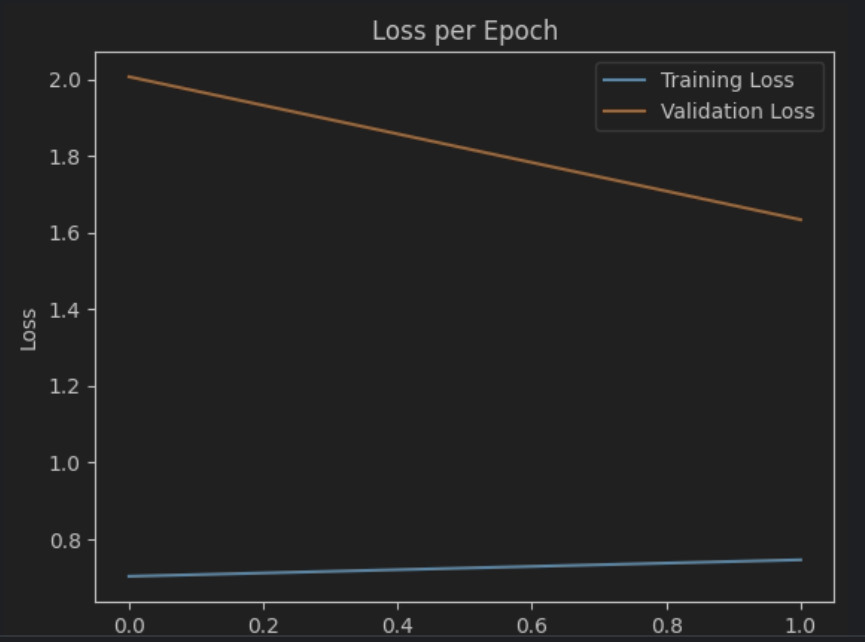
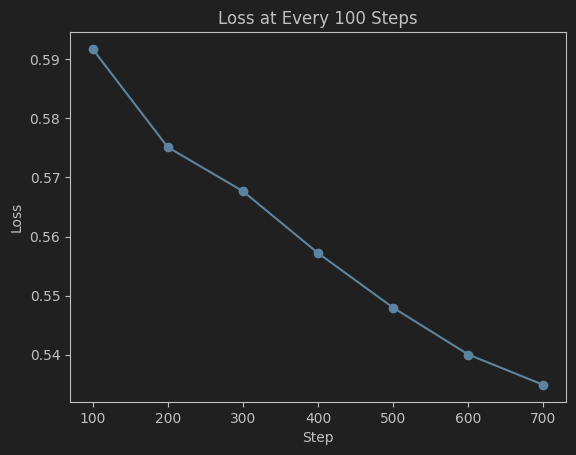

# Deep Learning Image Recognition with CNNs - CS672 Project 3
## Introduction
This project for CS672 (Introduction to Deep Learning, Fall 2023, Pace University) focuses on developing Convolutional Neural Networks (CNNs) using TensorFlow and PyTorch. The primary goal is to enhance image recognition accuracy on the Kaggle Cats and Dogs Dataset.

## Requirements
1. TensorFlow (latest version)
2. PyTorch (latest version)
3. Python 3.x 
4. Kaggle Cats and Dogs Dataset 
5. Additional Python libraries: NumPy, Matplotlib, etc.

## Installation
### TensorFlow:
Install TensorFlow using pip install tensorflow.
### PyTorch:
Install PyTorch from the official website as per your OS and CUDA version using pip install torch torchvision.
### Dataset:
Download the Kaggle Cats and Dogs Dataset and prepare it for use.

## Other Dependencies:

Install additional libraries using pip install numpy matplotlib.

## Usage

## Import Libraries:
TensorFlow, Keras (for Sequential models, layers like Conv2D, MaxPooling2D, Flatten, Dense, Dropout, BatchNormalization), and ImageDataGenerator for image preprocessing are imported.
Standard libraries like os, shutil, and numpy are also imported for file and data manipulation.

## Data Preparation:
Paths for the original dataset and train-test splits are defined.
Functions for splitting the data into training and testing sets are implemented.

## Implementation Details

### TensorFlow Model:
A CNN model is defined using Keras' Sequential method.
The model includes convolutional layers (Conv2D), batch normalization, pooling layers (MaxPooling2D), a flattening layer, dense layers for classification, and a dropout layer for regularization.

## Results

### TensorFlow Model:

Accuracy and loss plots for training and validation data.

### PyTorch Model:

Accuracy and loss plots for training and validation data.

